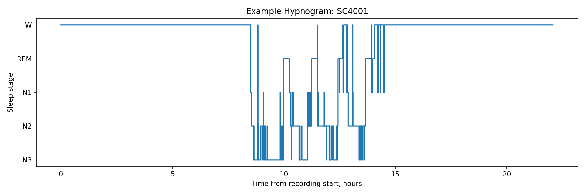
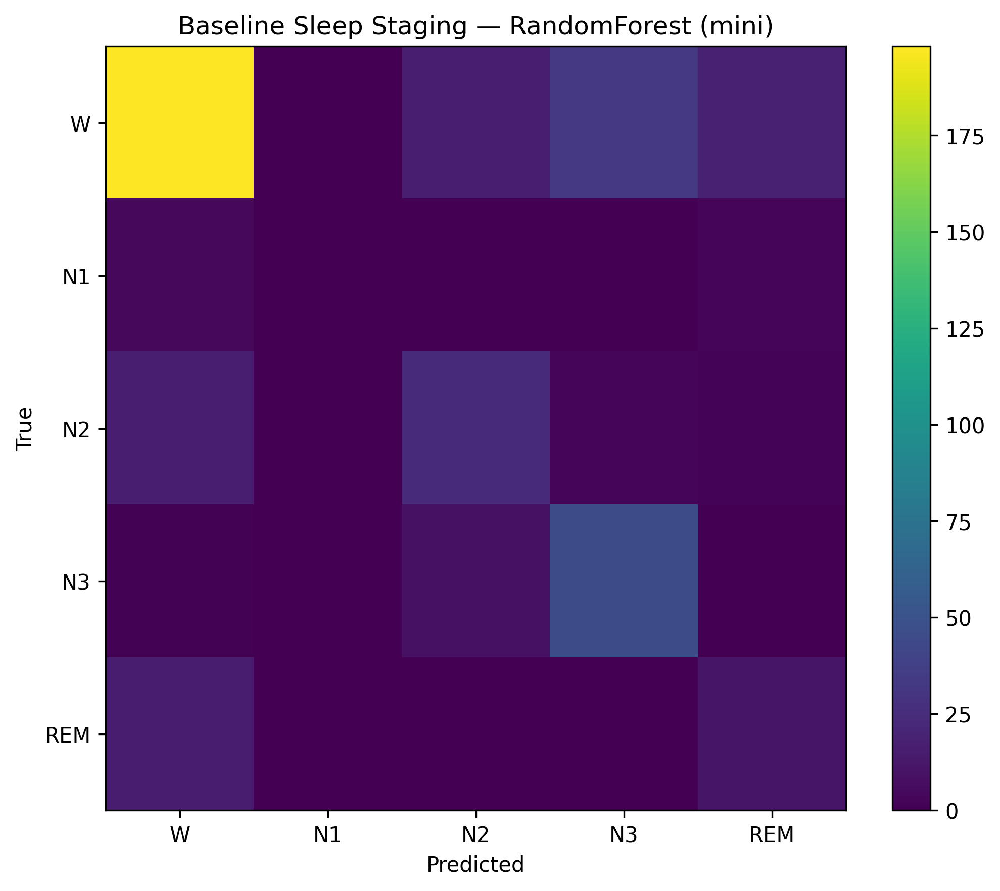
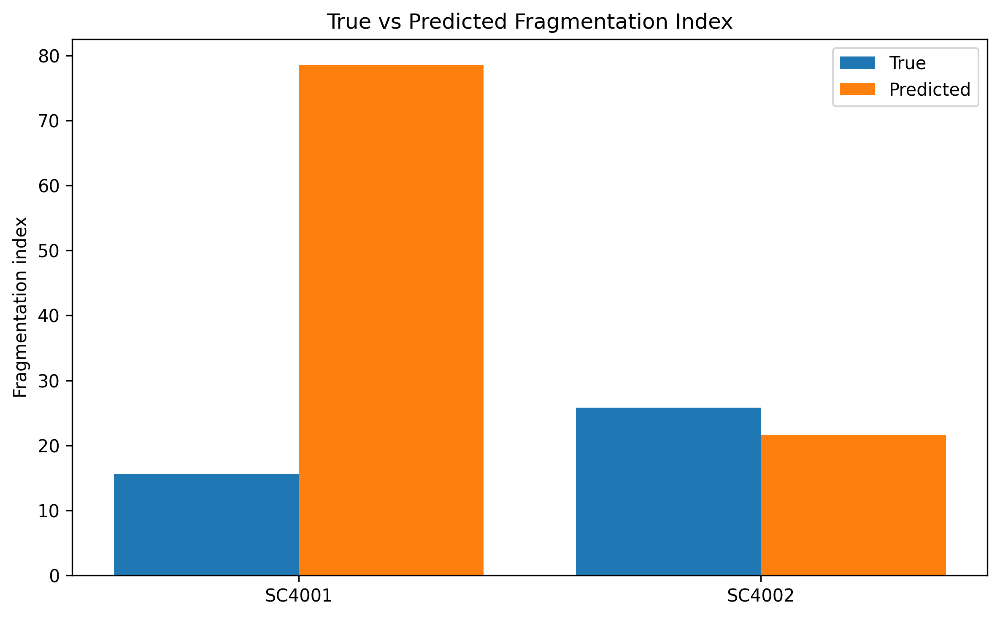
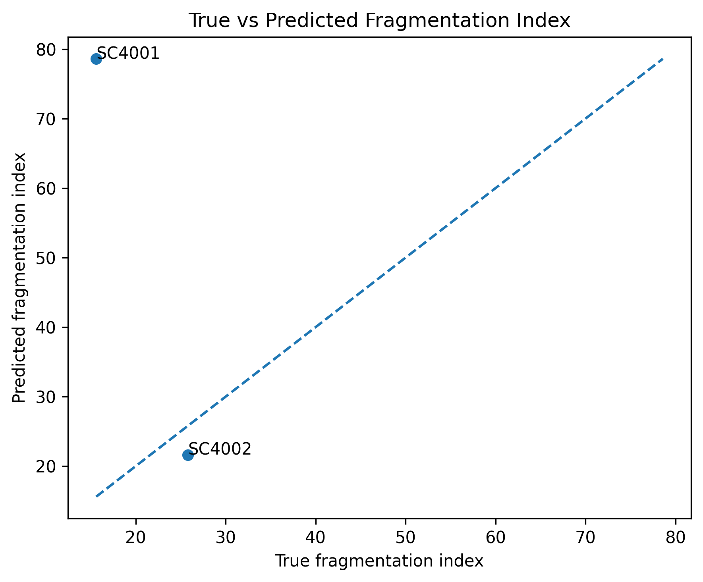

# Sleep Staging and Fragmentation Detection

An exploratory neurotechnology project for automatic sleep-stage classification and sleep-fragmentation analysis using open Sleep-EDF polysomnography data.

This project builds an end-to-end baseline pipeline that loads Sleep-EDF annotations, converts hypnogram data into 30-second epoch labels, trains a baseline sleep-stage classifier, and derives sleep-fragmentation metrics from true and predicted stage sequences.

The project is designed as a portfolio-quality computational neuroscience / neurotechnology case study rather than a clinical decision system.

## Project Goal

The goal of this project is to:

- load Sleep-EDF hypnogram files;
- convert sleep annotations into epoch-level labels;
- prepare EEG-derived sleep-staging features;
- train a baseline sleep-stage classifier;
- evaluate stage-level classification performance;
- compute sleep-fragmentation metrics from true and predicted stage sequences;
- compare true and predicted sleep-fragmentation patterns.

## Dataset

This project uses a small subset of Sleep-EDF Expanded.

The current mini-version validates the full modeling pipeline on a limited subset of subjects and sampled epochs before scaling to a larger sample.

Raw Sleep-EDF PSG files are not included in this repository because they are large. Small hypnogram EDF files used for annotation examples are stored in:

`data/raw/sleep-edf/`

Processed epoch-level tables and model outputs are stored in:

`data/processed/`

## Project Structure

- `notebooks/01_data_loading_and_epoching.ipynb` — data loading, annotation mapping and epoch table creation.
- `notebooks/02_baseline_sleep_staging_clean.ipynb` — baseline sleep-stage classification with EEG spectral features.
- `notebooks/03_fragmentation_metrics.ipynb` — sleep-fragmentation metrics from true and predicted stage sequences.
- `data/raw/sleep-edf/` — small Sleep-EDF hypnogram files used in the mini-version.
- `data/processed/` — processed epoch tables, predictions, classification reports and metrics.
- `figures/` — visual results used for reporting and README.
- `requirements.txt` — Python dependencies.
- `LICENSE` — MIT license.

## Methods

- Sleep-EDF hypnogram processing
- 30-second epoch label construction
- Sleep-stage mapping
- EEG spectral feature preparation
- Baseline Random Forest classification
- Subject-aware cross-validation
- Confusion matrix analysis
- Sleep-fragmentation metrics
- True vs predicted fragmentation comparison

## Notebooks

| Notebook | Description |
|---|---|
| `01_data_loading_and_epoching.ipynb` | Load Sleep-EDF hypnogram annotations, map labels and create an epoch-level dataset |
| `02_baseline_sleep_staging_clean.ipynb` | Extract EEG spectral features and train a baseline sleep-stage classifier |
| `03_fragmentation_metrics.ipynb` | Compute sleep-fragmentation metrics from true and predicted stage sequences |

## Current Baseline Result

The current mini-baseline was trained on a small subset of subjects and sampled epochs to validate the end-to-end pipeline.

Observed pattern:

- best performance on Wake and N3;
- moderate performance on N2;
- weaker performance on REM;
- poorest performance on N1.

This pattern is expected in baseline sleep staging because N1 is both rare and difficult to separate from neighboring stages.

## Key Visual Results

### Hypnogram Example



### Baseline Confusion Matrix



### Fragmentation Index: True vs Predicted



### Fragmentation Metrics Scatter Plot



## Why This Project Matters

This project demonstrates skills relevant to neurotechnology and computational neuroscience roles:

- working with physiological time-series data;
- building reproducible preprocessing pipelines;
- extracting interpretable signal features;
- training and evaluating baseline ML models;
- translating predictions into sleep-quality and fragmentation metrics;
- communicating technical limitations clearly.

## Installation

Clone the repository:

```bash
git clone https://github.com/kva99kva-eng/Sleep-Staging-Fragmentation-Detection.git
```

Go to the project folder:

```bash
cd Sleep-Staging-Fragmentation-Detection
```

Create and activate a virtual environment:

```bash
python -m venv .venv
.venv\Scripts\Activate.ps1
```

Install dependencies:

```bash
pip install -r requirements.txt
```

Run Jupyter Lab:

```bash
jupyter lab
```

Then run the notebooks in order from `01` to `03`.

## Limitations

- The current modeling uses a mini-subset for pipeline validation.
- Only a baseline classical ML approach is included so far.
- No deep learning model has been added yet.
- Raw PSG files are not included because they are large.
- The project is exploratory and not intended for clinical use.

## Future Work

- Scale the baseline to more Sleep-EDF subjects.
- Compare Random Forest with logistic regression and deep learning baselines.
- Improve performance on minority stages such as N1.
- Extend fragmentation analysis to larger subject cohorts.
- Add subject-level error analysis.
- Add true-vs-predicted hypnogram comparisons.

## Tech Stack

- Python
- pandas
- NumPy
- Matplotlib
- SciPy
- scikit-learn
- MNE
- Jupyter Lab

## License

This project is licensed under the MIT License.
